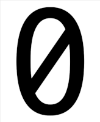
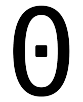

# Hack with an alternative zero.

Like [Hack](https://github.com/ryanoasis/nerd-fonts) fonts? Dislike
zeros with vertical strikes? Then this package is for you. Desktop (ttf)
and web (woff) fonts included.

Generated with [alt-hack](https://github.com/source-foundry/alt-hack) glyphs,
and [the `generator.ros` Common Lisp script](https://github.com/equwal/alt-hack/tree/generator.ros).

The zeros:
[]

[]

The old zero:
[]

[Code (gist) to change your font in Emacs](https://gist.github.com/equwal/89b1ef5ac8d4d737cfd37f66e9ba4895).
